# 🌊Resume in Flow chart.
````markdown
Portfolio repository of my professional career in IT
````

``` mermaid
classDiagram

%%Academic History chart
Academic_History --* Associate_Degree_in
Associate_Degree_in : Systems Analysis and Development[Institution_Multivix] --- Status_Pursuing🏃
Associate_Degree_in : The Odin Project "Foundations Course"[Community Academic Project] --- Status_Pursuing🏃
Associate_Degree_in : System Development [Institution_SENAI] --- Status(Complete)🏆
Associate_Degree_in : Psicologist [Institution_FAVI] --- Status(Complete)🏆

%%Work place chart
Professional_Experience--> WorkP1 : Working Currently
Professional_Experience --> WorkP2: Worked Previously

WorkP1 : Ctrl+Play🚀
WorkP1 : Entry--April/08/2025
WorkP1 : RolePerformed = System internship in systems analysis and development()

WorkP2 : SilkPress📦
WorkP2 : Entry--08/15/2024 Terminated--02/21/2025
WorkP2 : RolePerformed = Storage Manager()

%%IDE Knowledge Chart
IDE Knowledge --> Basic
IDE Knowledge --> Intermediate
IDE Knowledge --> Advanced

class Basic {
    Pycharm🐍
    Arduino IDE🟦
    Google Colab(🐍)
}   
class Intermediate {
   Net Beans(☕)   
   IntelliJ ☕
}
note for Advanced "In Construction..."
class Advanced { 
 
}

%%Style Code
classDef default fill:#E0CB2B,color:red

class Professional_Experience:::mainclass
classDef mainclass color:#3A2BE0


style Associate_Degree_in fill:#92E02B,stroke-width:3px

style WorkP1 fill:#DEE02B,stroke-width:3px
style WorkP2 fill:#DEE02B,stroke-width:3px

style Basic fill:#E0B52B
style Intermediate fill:#E0B52B
style Advanced fill:#E0B52B

style Professional_Experience fill:#E0D475,stroke:#103,stroke-width:6px
style IDEKnowledge fill:#E0D475,stroke:#103,stroke-width:6px
style Academic_History fill:#E0D475,stroke:#103,stroke-width:6px

```

<p align="center" dir="auto" style="max-width:100%;">
    
    
    
</p>


------------
## 📚Showcase of skills 

``` mermaid
journey
    title My Skills in Bars📊
     section Back-End Skills🧠
      Java: 6: Intermediate
      Spring Boot: 4: Beginner 
      Python: 4 : Beginner
      C++: 3: Beginner
    section Front-End Skills💻
      HTML: 4: Beginner
      CSS: 3: Beginner
      Java Script: 4: Beginner
    section Languages📖
        Portuguese:7 : Fluent
        English: 7 : Fluent
        Spanish: 5: Intermediate
```

----
## 🥧Soft Skills Pie

## Contact info 📧

<p dir="auto" style="max-width:100%;">
     brenomgoulart@hotmail.com
</p>
<p>
      +55 (27) 9 8833-4250
</p>
